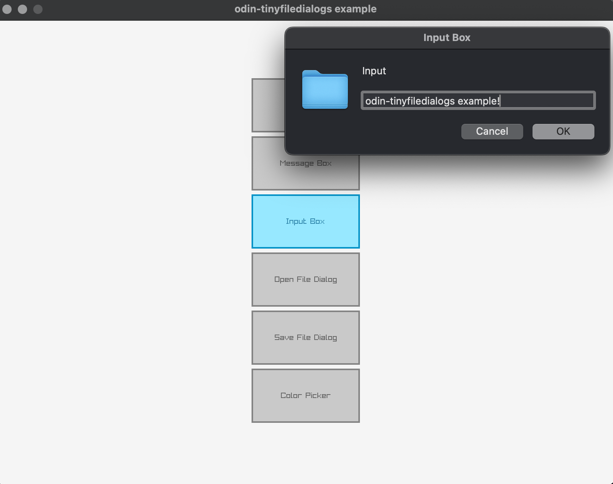

# odin-tinyfiledialogs

[Odin](https://odin-lang.org/) bindings for [`tinyfiledialogs`](https://sourceforge.net/projects/tinyfiledialogs/).

## Usage

- Copy the `tinyfiledialogs` directory to your project.
- Import `tinyfiledialogs` and use the bindings.
- There's an example desktop app that you can run with `odin run example/raylib.odin -file`.



- Or, if you prefer, there are some command line examples that you can run, too.

```
- See the `example` directory for a simple example.
odin build example/main.odin -out:examples -file
# Or examples.exe on Windows
./examples -help
# This is a single example. See the enum in `example/main.odin` for all types.
./examples -type:input
```

- If you're on Windows, you can also run the `example/main_windows.odin` examples to test the UTF-16 versions of the functions.

## Building

There are pre-built libraries available for multiple platforms. You may want to build your own, however. You can use the `build.sh` and `build.bat` files to build the libraries or as a starting point.

## Status

- Tested on macOS arm64 and Windows amd64.
- There are Linux libraries that I built but they are completley untested.

## License

[zlib](https://opensource.org/license/zlib)
